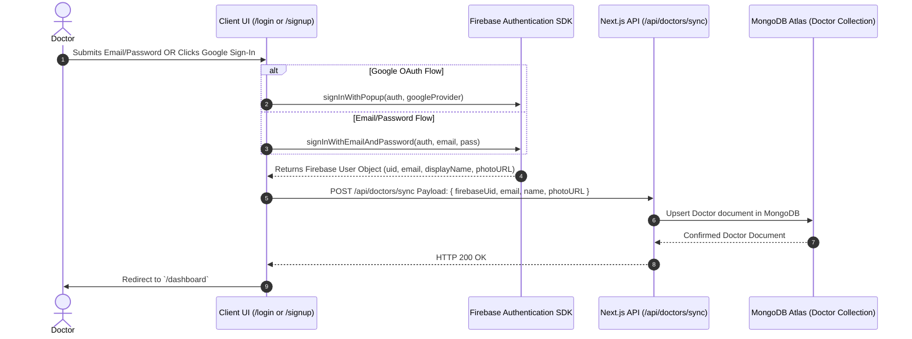
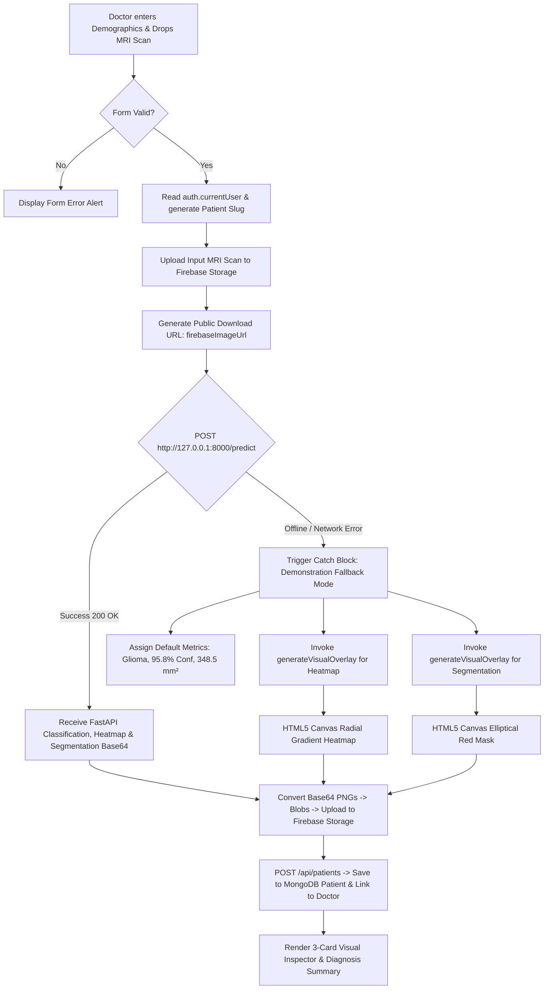

# BrainTumorAI — Frontend Technical Pathways & Workflows Specification

## Executive Summary

This technical specification details **every single pathway, user flow, state lifecycle, API route, data fetch, client fallback engine, and UI component workflow** within the `frontend/` folder of the **BrainTumorAI Medical Decision Support System**.

Built on **Next.js 14 App Router**, **TypeScript**, **Tailwind CSS**, **Firebase Cloud Services**, and **MongoDB Atlas (Mongoose)**, the frontend serves as an interactive clinical workstation for neuro-oncological MRI diagnostics.

---

## Table of Contents

1. [Frontend Directory Structure](#1-frontend-directory-structure)
2. [Core Technology & Library Integration](#2-core-technology--library-integration)
3. [Pathway 1: Authentication & Doctor Session Lifecycle](#3-pathway-1-authentication--doctor-session-lifecycle)
4. [Pathway 2: Doctor Profile Synchronization API (`/api/doctors/sync`)](#4-pathway-2-doctor-profile-synchronization-api-apidoctorssync)
5. [Pathway 3: MRI Ingestion, AI Predict & Canvas Fallback Workflow (`/dashboard/add-patient`)](#5-pathway-3-mri-ingestion-ai-predict--canvas-fallback-workflow-dashboardadd-patient)
6. [Pathway 4: Patient Record Persistence & CRUD API Routes (`/api/patients`)](#6-pathway-4-patient-record-persistence--crud-api-routes-apipatients)
7. [Pathway 5: Clinical Dashboard & Analytics Engine (`/dashboard`)](#7-pathway-5-clinical-dashboard--analytics-engine-dashboard)
8. [Pathway 6: Patient Directory & Search Filtering (`/dashboard/patients`)](#8-pathway-6-patient-directory--search-filtering-dashboardpatients)
9. [Pathway 7: Diagnostic Report Workstation (`/dashboard/patient/[id]`)](#9-pathway-7-diagnostic-report-workstation-dashboardpatientid)
10. [Pathway 8: Doctor Profile & Credentials Workstation (`/dashboard/profile`)](#10-pathway-8-doctor-profile--credentials-workstation-dashboardprofile)
11. [Frontend TypeScript Interfaces & Database Models](#11-frontend-typescript-interfaces--database-models)

---

## 1. Frontend Directory Structure

```
frontend/
├── docs/                             # Workspace user documentation
├── public/                           # Static public web assets
├── src/
│   ├── app/                          # Next.js 14 App Router
│   │   ├── api/                      # Node.js Serverless API Routes
│   │   │   ├── doctors/
│   │   │   │   ├── profile/route.ts  # Doctor profile GET & PUT route
│   │   │   │   └── sync/route.ts     # Firebase Auth -> MongoDB Doctor sync
│   │   │   └── patients/
│   │   │       ├── route.ts          # Patient list GET & create POST route
│   │   │       └── [id]/route.ts     # Single patient GET & delete DELETE route
│   │   ├── dashboard/                # Clinical Doctor Workstation Pages
│   │   │   ├── add-patient/page.tsx  # MRI Upload, AI Predict, Canvas Fallback
│   │   │   ├── patient/[id]/page.tsx # Patient Report Details & Probabilities
│   │   │   ├── patients/page.tsx     # Directory, Real-Time Search & Delete
│   │   │   ├── profile/page.tsx      # Doctor Profile Credentials
│   │   │   └── page.tsx              # Dashboard Main Analytics & Feed
│   │   ├── login/page.tsx            # Firebase Auth Login Page
│   │   ├── signup/page.tsx           # Doctor Signup Page
│   │   ├── favicon.ico
│   │   ├── globals.css               # Global Tailwind directives & custom CSS
│   │   ├── layout.tsx                # Root HTML Layout wrapper
│   │   └── page.tsx                  # Landing Page
│   ├── lib/
│   │   ├── firebase.ts               # Firebase App, Auth & Storage init
│   │   └── mongodb.ts                # Mongoose singleton connection manager
│   └── models/
│       ├── Doctor.ts                 # Mongoose Doctor Schema & TS Interface
│       └── Patient.ts                # Mongoose Patient Schema & TS Interface
├── package.json                      # Project dependencies & scripts
├── tsconfig.json                     # TypeScript configuration
└── tailwind.config.ts                # Tailwind styling tokens
```

---

## 2. Core Technology & Library Integration

- **Framework**: Next.js 14 (`app/` directory router with React Client Components `"use client"`).
- **Authentication**: Firebase Client SDK `firebase/auth` (`signInWithEmailAndPassword`, `createUserWithEmailAndPassword`, `signInWithPopup`, `GoogleAuthProvider`).
- **Cloud Binary Storage**: Firebase Client SDK `firebase/storage` (`ref`, `uploadBytes`, `getDownloadURL`).
- **Database Persistence**: Mongoose driver with connection caching (`global.mongoose`).
- **Icons & Styling**: Lucide React (`lucide-react`) combined with Tailwind CSS styling tokens.

---

## 3. Pathway 1: Authentication & Doctor Session Lifecycle

### 3.1 Authentication Workflow Diagram



### 3.2 Key Handlers & Code Traces

- **Firebase Config ([`firebase.ts`](file:///c:/Users/HP/Major_Project-_27/frontend/src/lib/firebase.ts))**:
  ```typescript
  export const auth = getAuth(app);
  export const storage = getStorage(app);
  ```
- **Login Handler ([`login/page.tsx`](file:///c:/Users/HP/Major_Project-_27/frontend/src/app/login/page.tsx))**:
  - Handles credential submission, catches Firebase auth codes (e.g. `auth/user-not-found`, `auth/wrong-password`), triggers doctor sync, and navigates to `/dashboard`.

---

## 4. Pathway 2: Doctor Profile Synchronization API (`/api/doctors/sync`)

### 4.1 Route Specification (`POST /api/doctors/sync`)

- **Location**: [`frontend/src/app/api/doctors/sync/route.ts`](file:///c:/Users/HP/Major_Project-_27/frontend/src/app/api/doctors/sync/route.ts)
- **Database Logic**:
  1. Invokes `connectDB()` to retrieve or initialize the cached Mongoose connection.
  2. Queries `Doctor.findOne({ firebaseUid })`.
  3. If missing:
     - Parses `name` into `firstName` and `lastName`.
     - Falls back to `email.split('@')[0]` if name is unavailable.
     - Executes `Doctor.create({ firebaseUid, email, firstName, lastName, profilePic })`.
  4. If existing:
     - Updates `profilePic` if it was not previously set.
  5. Returns HTTP 200 with the Doctor Mongoose JSON document.

---

## 5. Pathway 3: MRI Ingestion, AI Predict & Canvas Fallback Workflow (`/dashboard/add-patient`)

This is the primary diagnostic input pathway located in [`add-patient/page.tsx`](file:///c:/Users/HP/Major_Project-_27/frontend/src/app/dashboard/add-patient/page.tsx).



### 5.1 Client-Side HTML5 Canvas Fallback Generator (`generateVisualOverlay`)

When the FastAPI Python backend is offline or unreachable, the frontend dynamically generates thermal heatmaps and red contour masks using HTML5 2D Canvas rendering:

```typescript
const generateVisualOverlay = (
  imageFile: File,
  type: "heatmap" | "segmentation"
): Promise<string> => {
  return new Promise((resolve) => {
    const img = new Image();
    const url = URL.createObjectURL(imageFile);
    img.onload = () => {
      const canvas = document.createElement("canvas");
      const ctx = canvas.getContext("2d");
      canvas.width = img.width || 400;
      canvas.height = img.height || 400;

      ctx.drawImage(img, 0, 0, canvas.width, canvas.height);
      const cx = canvas.width * 0.52;
      const cy = canvas.height * 0.44;
      const radius = Math.min(canvas.width, canvas.height) * 0.22;

      if (type === "heatmap") {
        const gradient = ctx.createRadialGradient(cx, cy, 0, cx, cy, radius);
        gradient.addColorStop(0, "rgba(239, 68, 68, 0.85)");    // Red Hotspot
        gradient.addColorStop(0.35, "rgba(245, 158, 11, 0.7)");  // Amber
        gradient.addColorStop(0.65, "rgba(16, 185, 129, 0.5)");  // Emerald
        gradient.addColorStop(0.85, "rgba(59, 130, 246, 0.3)");  // Blue
        gradient.addColorStop(1, "rgba(0, 0, 0, 0)");
        ctx.fillStyle = gradient;
        ctx.beginPath();
        ctx.arc(cx, cy, radius, 0, Math.PI * 2);
        ctx.fill();
      } else {
        ctx.fillStyle = "rgba(239, 68, 68, 0.45)";
        ctx.strokeStyle = "rgba(239, 68, 68, 0.95)";
        ctx.lineWidth = 3;
        ctx.beginPath();
        ctx.ellipse(cx, cy, radius * 0.75, radius * 0.6, Math.PI / 6, 0, Math.PI * 2);
        ctx.fill();
        ctx.stroke();
      }

      const dataUrl = canvas.toDataURL("image/png");
      resolve(dataUrl.split(",")[1] || "");
    };
    img.src = url;
  });
};
```

---

## 6. Pathway 4: Patient Record Persistence & CRUD API Routes (`/api/patients`)

### 6.1 API Route Matrix

| Route Endpoint | HTTP Method | Input Parameters | Operation Performed | Response Schema |
| :--- | :--- | :--- | :--- | :--- |
| `/api/patients` | `GET` | `?doctorId=<uid>` | Fetches all patients for doctor sorted by `createdAt: -1` | `{ success: true, data: IPatient[] }` |
| `/api/patients` | `POST` | Patient JSON Body | Creates `Patient` record & pushes subdocument into `Doctor.patients` | `{ success: true, data: IPatient }` |
| `/api/patients/[id]` | `GET` | Route param `id` | Fetches single patient diagnostic evaluation record | `{ success: true, data: IPatient }` |
| `/api/patients/[id]` | `DELETE` | Route param `id` | Deletes patient record & pulls from `Doctor.patients` array | `{ success: true, message: "..." }` |

---

## 7. Pathway 5: Clinical Dashboard & Analytics Engine (`/dashboard`)

- **Location**: [`frontend/src/app/dashboard/page.tsx`](file:///c:/Users/HP/Major_Project-_27/frontend/src/app/dashboard/page.tsx)
- **Metrics Computation**:
  ```typescript
  const totalPatients = patients.length;
  const tumorDetectedCount = patients.filter((p) => p.tumorDetected).length;
  const normalScansCount = patients.filter((p) => !p.tumorDetected).length;
  ```
- **Feed Rendering**: Filters top 5 recent patient evaluations and displays status pills (`Tumor Detected (Conf %)` in red vs `No Tumor Detected` in emerald).

---

## 8. Pathway 6: Patient Directory & Search Filtering (`/dashboard/patients`)

- **Location**: [`frontend/src/app/dashboard/patients/page.tsx`](file:///c:/Users/HP/Major_Project-_27/frontend/src/app/dashboard/patients/page.tsx)
- **Client-Side Filtering**:
  ```typescript
  const filteredPatients = patients.filter((p) => {
    const matchesSearch = p.patientName.toLowerCase().includes(searchTerm.toLowerCase());
    const matchesFilter =
      filterClass === "ALL" ? true :
      filterClass === "TUMOR" ? p.tumorDetected :
      filterClass === "NORMAL" ? !p.tumorDetected :
      (p.tumorType || "").toUpperCase() === filterClass;
    return matchesSearch && matchesFilter;
  });
  ```

---

## 9. Pathway 7: Diagnostic Report Workstation (`/dashboard/patient/[id]`)

- **Location**: [`frontend/src/app/dashboard/patient/[id]/page.tsx`](file:///c:/Users/HP/Major_Project-_27/frontend/src/app/dashboard/patient/[id]/page.tsx)
- **Core Visual Modules**:
  1. **Evaluation Banner**: Displays Evaluation ID (`#id.substring(len-6)`), patient age, gender, and scan date.
  2. **Class Probability Progress Bars**: Animated percentage bars for Glioma, Meningioma, Pituitary, and No Tumor.
  3. **Multi-Modal Visual Assets**: 3-card viewer showing Original Input MRI, Grad-CAM Heatmap Overlay, and Attention U-Net Mask.
  4. **Morphological Measurements**: Surface area ($mm^2$) display and clinical recommendation logic:
     ```typescript
     patient.severity === "Low" ? "Schedule 3-Month Follow-Up MRI" : "Immediate Neurological Consultation"
     ```

---

## 10. Pathway 8: Doctor Profile & Credentials Workstation (`/dashboard/profile`)

- **Location**: [`frontend/src/app/dashboard/profile/page.tsx`](file:///c:/Users/HP/Major_Project-_27/frontend/src/app/dashboard/profile/page.tsx)
- **API Endpoint**: `GET /api/doctors/profile?doctorId=<uid>` and `PUT /api/doctors/profile`.
- **Dynamic Stats Badge**: Fetches and displays total linked patients for the authenticated doctor.

---

## 11. Frontend TypeScript Interfaces & Database Models

### 11.1 Patient Interface (`IPatient`)

```typescript
export interface IPatient extends Document {
  doctorId: string;
  patientName: string;
  patientAge: number;
  patientGender: "Male" | "Female" | "Other";
  imagePath: string;
  heatmapPath?: string;
  segmentationPath?: string;
  tumorDetected: boolean;
  tumorType?: "Glioma" | "Meningioma" | "Pituitary" | "No Tumor";
  confidence?: number;
  probabilities?: {
    glioma?: number;
    meningioma?: number;
    pituitary?: number;
    noTumor?: number;
  };
  tumorSize?: {
    width?: number;
    height?: number;
    area?: number;
  };
  severity?: "None" | "Needs Review" | "Low" | "Medium" | "High";
  status: "Processing" | "Completed" | "Failed";
  scanDate: Date;
  createdAt: Date;
  updatedAt: Date;
}
```

### 11.2 Doctor Interface (`IDoctor`)

```typescript
export interface IDoctor extends Document {
  firebaseUid: string;
  firstName: string;
  lastName?: string;
  email: string;
  hospitalName?: string;
  specialization: string;
  phone?: string;
  profilePic?: string;
  patients: IPatient[];
  createdAt: Date;
  updatedAt: Date;
}
```

---

*Frontend Technical Specification compiled specifically for the `frontend/` workspace directory.*
